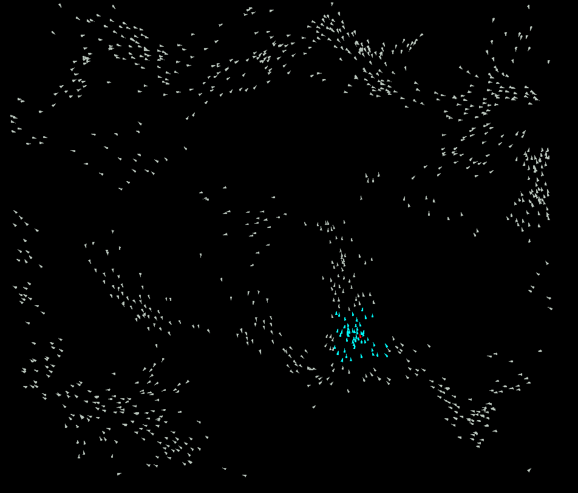

<!-- ⚠️ This README has been generated from the file(s) "blueprint.md" ⚠️--><h1 align="center">Boids</h1>

  

## ➤ Table of Contents

* [➤ :pencil: About The Project](#-pencil-about-the-project)
* [➤ :rocket: Dependencies](#-rocket-dependencies)
* [➤ :floppy_disk: Key Project File Description](#-floppy_disk-key-project-file-description)
* [➤ :coffee: Buy me a coffee](#-coffee-buy-me-a-coffee)
* [➤ :scroll: Credits](#-scroll-credits)
* [➤ License](#-license)

## ➤ :pencil: About The Project

This project is an interactive 3D-rendered flock simulation inspired by the pioneering work of [Craig Reynolds](https://www.red3d.com/cwr/index.html) in his 1987 [paper](https://www.red3d.com/cwr/boids/). The project brings to life the fascinating dynamics of flock behaviour with over 1000 individual Boids that closely follow the principles outlined in Reynolds' paper. The heart of this simulation lies in implementing three crucial rules: Alignment, Separation, and Cohesion.

**Alignment:** Each Boid in the simulation attempts to align its velocity with its neighbouring Boids. This rule creates the illusion of birds flying in the same general direction, maintaining a sense of unity within the flock.

**Separation:** Boids actively avoid colliding with their peers by calculating the direction towards other Boids and applying the opposite direction to their velocity. This behaviour results in the characteristic avoidance of collisions. It is fundamental in creating the appearance of individual Boids manoeuvring within the flock.

**Cohesion:** To mimic the natural tendency of birds sticking together, Boids are drawn towards the average position of their nearby companions. This cohesion rule ensures the flock remains relatively tightly knit and exhibits the graceful and cohesive movement observed in real-life bird flocks.

To enhance the performance of this simulation, I use a quad-tree data structure. Quad-trees facilitate efficient spatial partitioning of the Boids within the 3D world by recursively dividing the simulation space into smaller quadrants, with each quadrant containing a subset of Boids. This partitioning significantly improves the computational efficiency of the simulation, allowing it to run smoothly even when dealing with a large number of Boids. It helps each Boid effectively search for nearby Boids and apply the three principles in O(nlogn) time, contributing to the overall realism and smoothness of the flocking behaviour.

You can experience this mesmerizing 3D flock simulation at [boids.theo-moore-calters.online](https://boids.theo-moore-calters.online). It beautifully captures the essence of bird-like flocking behaviour, demonstrating the elegance and simplicity of the principles put forth by Craig Reynolds in his iconic Boids paper.

## ➤ :rocket: Dependencies

The project is built using **Vite** and implemented in **JavaScript**. For the visual representation of the simulation, this project leverages the **Three.js** library.
  
 
 

## ➤ :floppy_disk: Key Project File Description

* The [`main.js`](code/main.js) file initializes the 3D flock simulation with Boids. It runs the principles of alignment, cohesion, and separation on each boid every frame. Key functionalities include creating a scene, camera, and renderer, handling user input for enabling/disabling principles and boid movement, and updating the simulation's state. The code also manages the insertion of Boids into the Quad-tree.
*  The [`boidAgent.js`](code/boidAgent.js) file represents individual boids in a 3D flock simulation. Each boid's behaviour is governed by principles of alignment, cohesion, and separation. The class handles boid movement, rotation, and interaction with neighbouring Boids using quad-tree spatial partitioning for efficient performance.
*  The [`quadTree.js`](code/quadTree.js) file defines a spatial data structure for efficient region-based querying of objects. It subdivides a given area into quadrants and organises objects within these quadrants. Key functions include insertion, finding objects within a specified range, and dividing the area into smaller quadrants when needed. Has complexity O(nlogn), read more [here](https://en.wikipedia.org/wiki/Quadtree).
*  The [`keyBoardInputs.js`](code/keyBoardInputs.js) file is a simple logger for keyboard inputs.

## ➤ :coffee: Buy me a coffee
Whether you use this project, have learned something from it, or just like it, please consider supporting it by buying me a coffee, so I can dedicate more time on open-source projects like this (҂⌣̀_⌣́)

## ➤ :scroll: Credits

Theo Moore-Calters 

 

## ➤ License
	
Licensed under [MIT](https://opensource.org/licenses/MIT).
